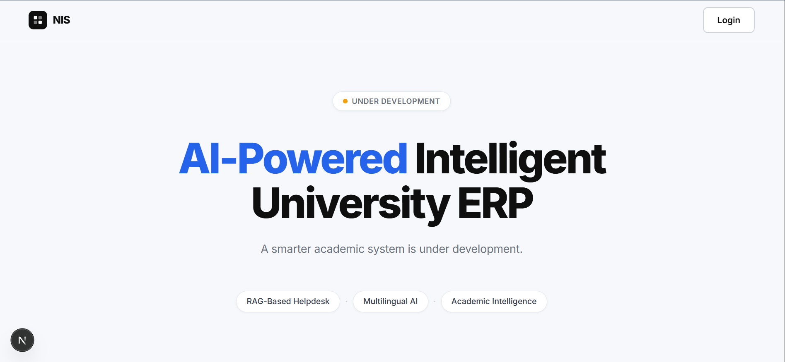

# AI-Powered Intelligent University ERP

A modular university ERP system with multilingual AI helpdesk, student dashboard, CGPA analytics, and placement intelligence. The platform combines relational university data with Retrieval-Augmented Generation (RAG) for semantic document-based query answering.

---

## 1. Clone Repository

```bash
git clone https://github.com/NJayantRao/Helpdesk-AI.git
cd Helpdesk-AI
```

---

## 2. Branching Strategy

To maintain a clean and stable codebase, **do not make direct changes to the `main` / `master` branch**.  
All development work should be done through dedicated branches following the naming conventions below.

| Branch Name              | Type           | Source Branch | Description                                                      |
| :----------------------- | :------------- | :------------ | :--------------------------------------------------------------- |
| **`main`** (or `master`) | **Production** | N/A           | Production-ready code. **Protected.** No direct edits allowed.   |
| **`feature/*`**          | **Feature**    | `main`        | For new features.<br>Ex: `feature/user-auth`                     |
| **`bugfix/*`**           | **Fix**        | `main`        | For standard bug fixes.<br>Ex: `bugfix/nav-alignment`            |
| **`hotfix/*`**           | **Urgent**     | `main`        | **Urgent** production fixes only.<br>Ex: `hotfix/security-patch` |

## 3. Development Workflow

### 3.1 The Workflow

1. **Sync with `main` branch**  
   Before starting work, switch to `main` and pull the latest changes:

   ```bash
   git checkout main
   git pull origin main
   ```

   Alternative way:-

   `git checkout main && git pull origin main`

2. **Create:** Create your branch based on the work type.

   ```bash
   git branch feature/my-cool-feature
   git checkout feature/my-cool-feature
   ```

   Alternative way:-

   ```bash
   git checkout -b feature/my-cool-feature
   ```

3. **Work:** Write code and commit.
4. **Push:** Push your branch to GitHub.
   ```bash
   git push origin feature/my-cool-feature
   ```
5. **Merge:** Open a Pull Request (PR) to merge your branch into `main`.

### 3.2 Commit Message Conventions

We adhere to the **Conventional Commits** specification.

### Format

`type(scope): subject`

### Types

- **feat**: A new feature
- **fix**: A bug fix
- **docs**: Documentation only changes
- **style**: Formatting (white-space, etc.)
- **refactor**: Code change that neither fixes a bug nor adds a feature
- **chore**: Maintenance tasks

**Examples:**

> `feat(auth): add google login`
> `fix(ui): adjust button padding on mobile`

---

## 3. Frontend Setup

```bash
cd client
npm install
npm run dev
```

Frontend runs on:

```bash
http://localhost:3000
```

### Expected Result:-

## 

## 4. Backend Setup

```bash
cd server
npm install
npm run dev
```

Backend runs on:

```bash
http://localhost:5000
```

## 5. Environment Setup

- Create a `.env` file in the appropriate project folder.
- Use the provided `.env.sample` file as a reference:
- Copy its contents into the `.env` file.
- Replace all placeholder values with your actual environment variables and API keys.
